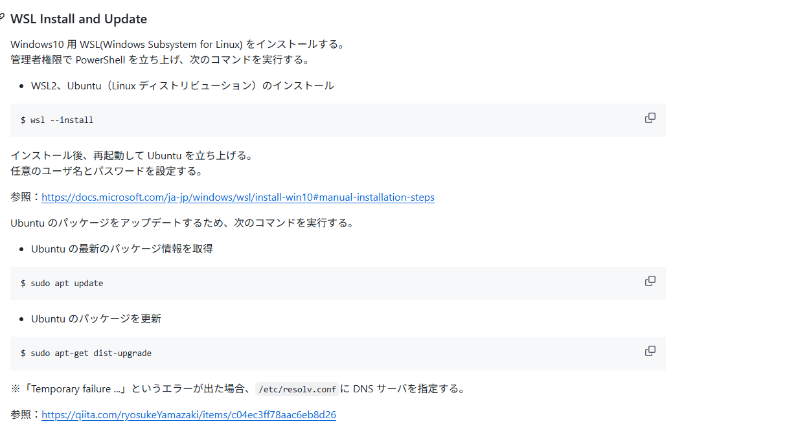
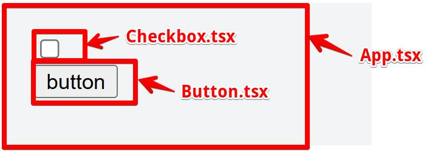
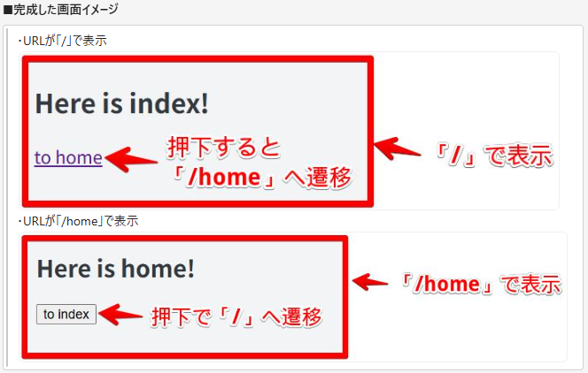
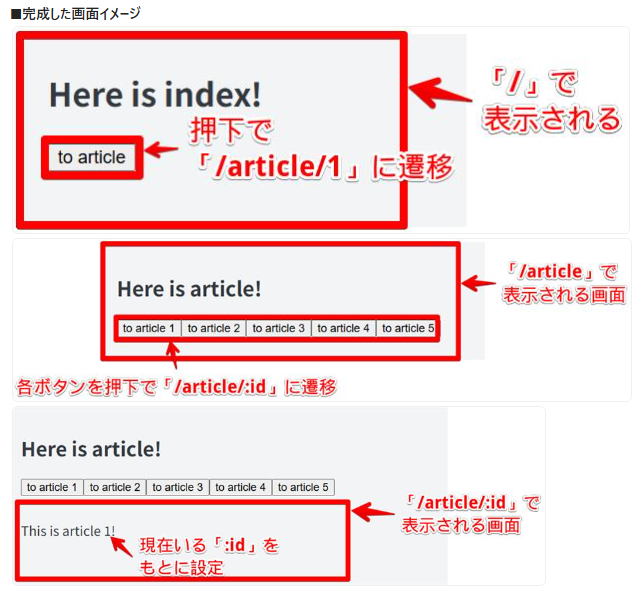
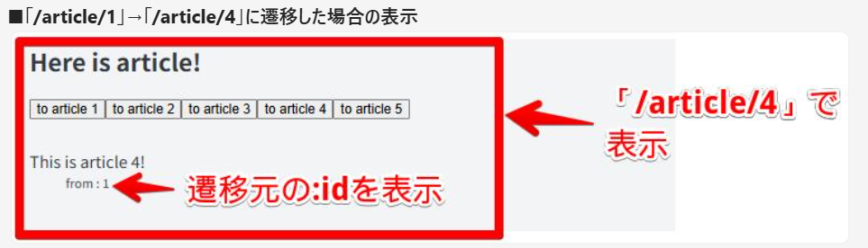
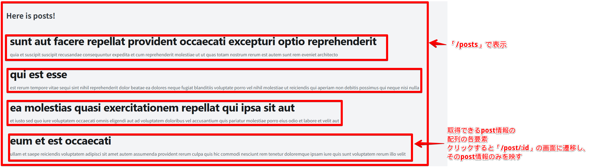

# 〇準備

- WSLをインストールし、Ubuntuを立ち上げる
  
- npm、reactをインストールしプロジェクトを作成・起動する\
  https://noauto-nolife.com/post/ubuntu-react-install/
- Visual Studio Codeで開く（`code .`）

# 〇React理解

### ◆SPAに関して

[今さら聞けないSPA（シングルページアプリケーション）とは](https://qiita.com/shinkai_/items/79e539b614ac52e48ca4)

飯田橋の開発環境

- PC(=`Backbone.js`)
- スマホ(=`React`)

  - どちらもSPA (Single Page Application)

- MPA（Multi Page Application）との違い
  - **HTMLの生成**⇒ MPA：サーバー側　SPA：クライアント側 ※初回読み込み時等を除く
  - **情報の更新**⇒ MPA：ページ遷移　SPA：コンテンツのみ更新

### ◆package.json / node_modules について

[そろそろ適当に npm install するのを卒業する](https://qiita.com/sugurutakahashi12345/items/3cc49926faeaf25d3051)

WEBアプリケーションを開発する際、外部パッケージを多く用いる。 (Reactもパッケージの1種)
`package.json`（パッケージを管理するファイル）について理解。

### ◆ビルドについて

[React がビルドされるまでの流れを理解したい](https://zenn.dev/aidemy/articles/355aff43e45c34)

SPAのアプリケーションを実行する際は、`HTML/JS`ファイルをアプリケーションからクライアントに送付する。
「`HTML/JS`ファイル」の実装内容を反映させられるように、ビルドツールによって以下を行う。

- TypeScript→JavaScriptへのトランスパイル
- `minify`（圧縮）
- 外部パッケージの解決 など

# 〇実装練習

### ◆componentとpropsの関係

1. `App.tsx`内に`checkbox/button`を作成し、`checkbox`が`checked`な状態なら`button`が非活性(`disabled`)になるように実装。
2. 1.の内容をファイル分割して実装。
   ※以下の3ファイルを作成
   ・`App.tsx`
   ・`Checkbox.tsx`
   ・`Button.tsx`
   

### ◆react-routerの使用

- `react-router`パッケージをインストール（`package.json dependencies`に追加）
- 「`/`」にて押下すると「`/home`」へ遷移するURLを記載
- 「`/home`」にて押下すると「`/`」へ遷移するボタンを実装
  ⇒ボタンについて、再利用性の高いcomponentを意識。
  

> ◎`useNavigate`フックを用いてページ遷移（ルーティング）を行う

> ◎`Botton.tsx`について、情報を渡して使用する形に定義すると再利用性が高くなる

### ◆ネストしているURLの実装

- 「`/`」にて押下すると「`/article`」へ遷移するボタンを実装
- 「`/article`」にて「`/article/:id`」へ遷移するボタンを1~5まで実装
- 「`/article:id`」では、「`/article`」の画面下部に「This is article :id !」と表示される
  

> ◎あるURL (`/article`) の共通レイアウト部分と、ネストしたURL (/:id) のレイアウト部分を共存させる場合、` <Outlet />`を用いる

> ◎`<Route />`の設定も調整する必要がある

> ◎URLパラメータの取得には、`useParams`フックを用いる

### ◆画面間での情報引継

- 「`/`」にて押下すると「`/article`」へ遷移するボタンを実装
- 「`/article`」にて「`/article/:id`」へ遷移するボタンを1~5まで実装
- 「`/article/:id`」では、「`/article`」の画面下部に「This is article :id !」と遷移元(前の画面)の「`/article/:id`」が表示される（「from:id」）
  ⇒「/」から遷移してきた場合は「from:id」が表示されない
  

> ◎`useLocation`フックを用いると、画面間で引き継ぐ情報( `state` )や現在のURL ( `pathname`)を取得できる

> ◎`??`や `||`、 `&&`の演算子を用いることで、`null`や`undefined`が入り込むことを防ぐことができる

### ◆API経由のデータ取得

- 「 https://jsonplaceholder.typicode.com/posts 」 にリクエストを送り、post情報の配列を取得
- 「`/posts`」にて取得したpost情報のタイトルを羅列表示、クリックすると「`/post/:id`」に遷移し、対応するpost情報（body）をタイトル下に表示する
  

> ◎`fetch`関数を用いて取得する

> ◎`useState`を用いて保持・表示する

> ◎`post`においても型定義を行い`any`型は使わない

### ◆データフェッチの方法を@tanstack/react-queryに変更

- `@tanstack/react-query`をインストール

```bash
npm install @tanstack/react-query
```

### ◆単体テストの実装

> ◎原則
>
> - `test`の説明 (第一引数) は、「~であること」のように期待値の内容を記述する
> - `test`のコールバック (第二引数) 内の`expect`は1つ ⇒1ケースあたり1つの期待値
> - モックの返り値指定や`render`関数の実行など、同じ処理を複数テストケースで実行する場合は、`describe`配下に複数`test`をまとめ、`beforeEach`を用いる
