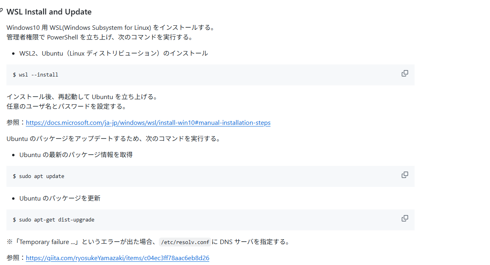
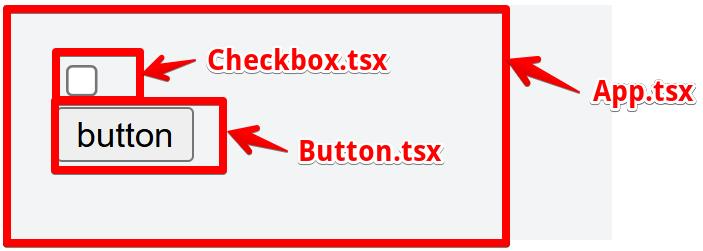
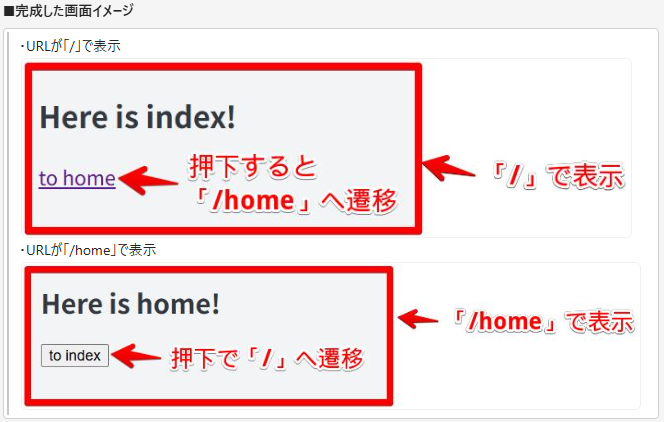
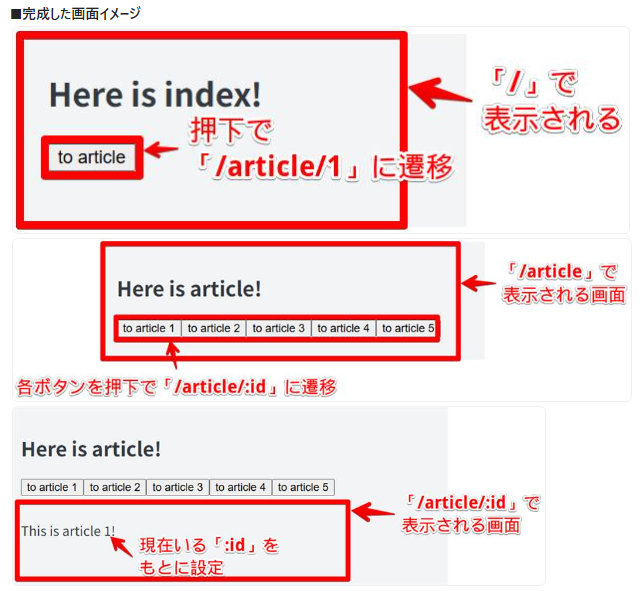
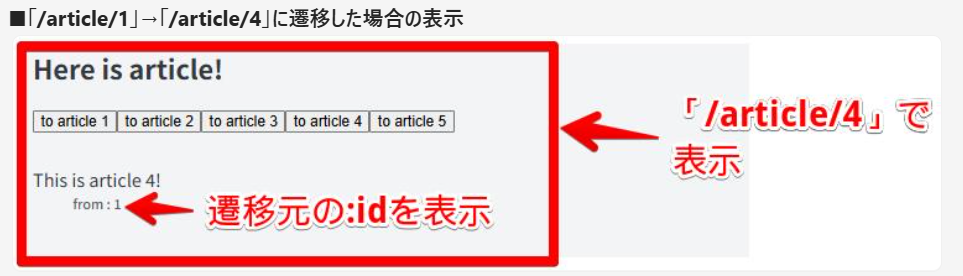
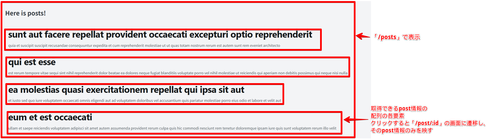

//準備
・WSLをインストールし、Ubuntuを立ち上げる

・npm、reactをインストールしプロジェクトを作成・起動する
https://noauto-nolife.com/post/ubuntu-react-install/
・Visual Studio Codeで開く（code .）

//React理解
◆SPAに関して
[今さら聞けないSPA（シングルページアプリケーション）とは](https://qiita.com/shinkai_/items/79e539b614ac52e48ca4)
飯田橋で開発しているWEBサイトのフロントエンドは、PC(=Backbone.js)・スマホ(=React)ともにSPA (Single Page Application) のプロジェクトとなっています。
研修で習うWEBサイトの仕組み(MPA)とは異なるので認識しておいた方がよいと思います。

◆package.json / node_modules について
[そろそろ適当に npm install するのを卒業する](https://qiita.com/sugurutakahashi12345/items/3cc49926faeaf25d3051)
WEBアプリケーションを開発する際、外部パッケージを多く用います (Reactもパッケージの1種と考えてよいです)。
例えば、カレンダーから日付を選択するページを作りたいとして、1から自分で実装するのは途方もない時間がかかりますよね? なので、カレンダーに関する実装を提供しているパッケージを使います。
その際に package.jsonというファイルがカギを握るので、その役割については知っておいた方がよいと思います。

◆ビルドについて
[React がビルドされるまでの流れを理解したい](https://zenn.dev/aidemy/articles/355aff43e45c34)
SPAのアプリケーションを実行する際、クライアントに送付するHTML/JSファイルをアプリケーションからクライアントに送付します。
「HTML/JSファイル」は実装内容がそのまま反映されるわけではなく、ビルドツールによってTS→JSへのトランスパイルやminify、外部パッケージの解決などを行います。

//実装練習
◆componentとpropsの関係
①　App.tsx内にcheckbox/buttonを作成し、checkboxがcheckedな状態ならbuttonが非活性(disabled)になるように実装。
②　①の内容をファイル分割して実装。
※以下の3ファイルを作成
・App.tsx
・Checkbox.tsx
・Button.tsx

◆react-routerの使用
・react-routerパッケージをインストール（package.json dependenciesに追加）
・「/」にて押下すると「/home」へ遷移するURLを記載
・「/home」にて押下すると「/」へ遷移するボタンを実装
⇒ボタンについて、再利用性の高いcomponentを意識。

◎useNavigateフックを用いてページ遷移（ルーティング）を行う
◎「Botton.tsx」について、情報を渡して使用する形に定義すると再利用性が高くなる

◆ネストしているURLの実装
・「/」にて押下すると「/article」へ遷移するボタンを実装
・「/article」にて「/article:id」へ遷移するボタンを1~5まで実装
・「/article:id」では、「/article」の画面下部に「This is article :id !」と表示される

◎あるURL (/article) の共通レイアウト部分と、ネストしたURL (/:id) のレイアウト部分を共存させる場合、 <Outlet />を用いる
◎<Route />の設定も調整する必要がある
◎URLパラメータの取得には、 useParamsフックを用いる

◆画面間での情報引継
・「/」にて押下すると「/article」へ遷移するボタンを実装
・「/article」にて「/article:id」へ遷移するボタンを1~5まで実装
・「/article:id」では、「/article」の画面下部に「This is article :id !」と遷移元(前の画面)の「/article/:id」が表示される（「from:id」）
⇒「/」から遷移してきた場合は「from:id」が表示されない

◎useLocationフックを用いると、画面間で引き継ぐ情報( state )や現在のURL ( pathname)を取得できる
◎??や ||、 &&の演算子を用いることで、nullやundefinedが入り込むことを防ぐことができる

◆API経由のデータ取得
・「https://jsonplaceholder.typicode.com/posts」にリクエストを送り、post情報の配列を取得
・「/posts」にて取得したpost情報のタイトルを羅列表示、クリックすると「/post/:id」に遷移し、対応するpost情報（body）をタイトル下に表示する

◎fetch関数を用いて取得する
◎useStateを用いて保持・表示する
◎postにおいても型定義を行いany型は使わない
